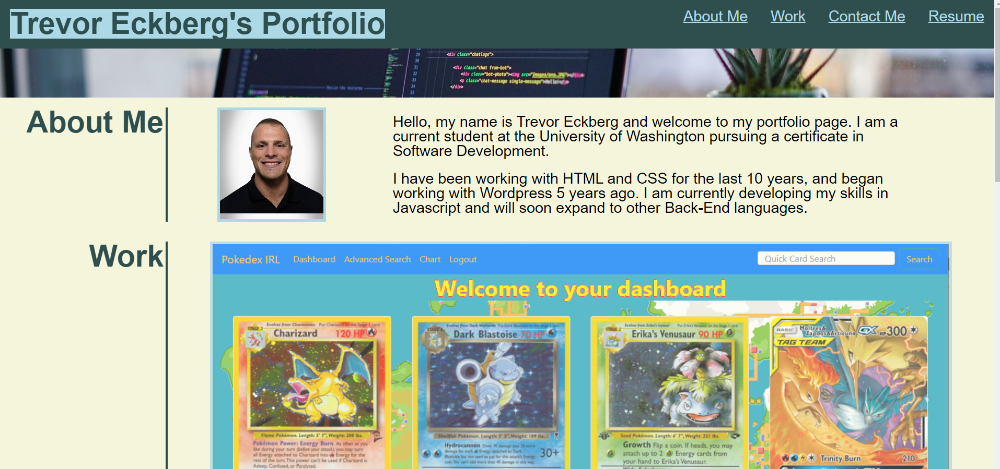

# React Portfolio

## Table of Contents
    
1. [Description](##description)
2. [Installation Instructions](##installation-instructions)
3. [Usage Information](##usage-information)
4. [Contribution Guidelines](##contribution-guidelines)
5. [Test Instructions](##test-instructions)
6. [Questions](##questions)
7. [License](##license)
8. [Screenshot](##screenshot)
    
    
## Description
This is a simple portfolio page that was initially designed using HTML and CSS and has been refactored using React, the page contains links to deployed versions of multiple user projects as well as links to LinkedIn.
    
## Installation Instructions
The deployed page can be found live at the link below.
    
## Usage Information
Click on any of the projects to be taken to the deployed application.
    
## Contribution Guidelines
This project is not currently accepting any community contributions.
    
## Test Instructions
This application does not have a built in test suite, please report any bugs to the developer.
    
## Questions
If you have further questions about the functionality of this application or need clarification regarding certain areas the creator can be contacted at: 
Email: trevor.eckberg@gmail.com  
Github: https://github.com/trev-eck/
    
## License
This application was developed under the MIT License

## Screenshot
A live version of the application is deployed at: https://te-react-portfolio.herokuapp.com/

This readme was generated using the ReadME Generator : https://github.com/trev-eck/readme-generator
